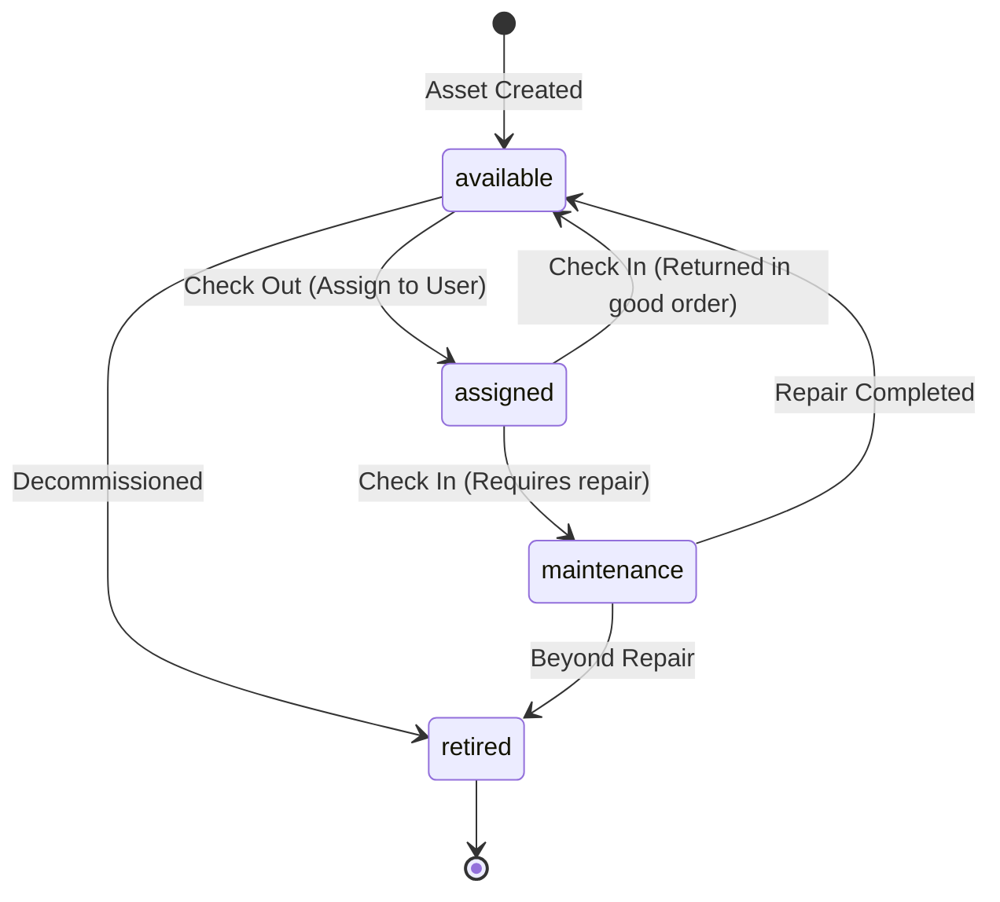

# Domain Model: Assets & Custody Assignments

This document defines the core business rules, entity models, and state transitions for the **AssetFlow** IT asset and hardware management domain.

---

## 1. Entities & Relationships

### `Asset`
Represents an individual physical piece of IT hardware (laptop, monitor, workstation, server, mobile phone, peripheral).

- **Attributes**:
  - `id`: Auto-incrementing primary key.
  - `asset_tag`: Unique human-readable identifier (e.g., `AST-00101`, `AST-00204`). Indexed and uppercase.
  - `name`: Name or title of the hardware (e.g. `MacBook Pro 16" M3 Max`).
  - `type`: Enum (`AssetType`: `laptop`, `desktop`, `monitor`, `mobile`, `server`, `peripheral`).
  - `status`: Enum (`AssetStatus`: `available`, `assigned`, `maintenance`, `retired`). Default: `available`.
  - `serial_number`: Manufacturer serial number (unique, nullable).
  - `model_number`: Manufacturer hardware model number (nullable).
  - `cost`: Monetary purchase cost in decimal(10,2) (nullable).
  - `purchased_at`: Purchase date (nullable).
  - `warranty_expires_at`: Warranty expiration date (nullable).
  - `notes`: Markdown notes / operational observations (nullable).
  - `created_at` / `updated_at`: Standard timestamps.

- **Relationships**:
  - `assignments()`: `HasMany` $\rightarrow$ `AssetAssignment` (Ordered by `assigned_at` descending).
  - `currentAssignment()`: `HasOne` $\rightarrow$ `AssetAssignment` (Where `returned_at` is null).
  - `user()`: `HasOneThrough` $\rightarrow$ `User` via `currentAssignment`.

---

### `AssetAssignment`
Represents a custody period where a specific asset is assigned/checked out to an employee.

- **Attributes**:
  - `id`: Auto-incrementing primary key.
  - `asset_id`: Foreign key $\rightarrow$ `assets.id` (`cascadeOnDelete`).
  - `user_id`: Foreign key $\rightarrow$ `users.id` (`cascadeOnDelete` - the team member holding custody).
  - `assigned_by`: Foreign key $\rightarrow$ `users.id` (the IT admin/manager who issued the asset).
  - `assigned_at`: Datetime when the asset was handed over.
  - `expected_return_at`: Date when the asset is expected back (nullable).
  - `returned_at`: Datetime when the asset was returned (nullable, null indicates active checkout).
  - `notes`: Operational notes regarding this specific assignment.
  - `condition_on_assignment`: String (e.g. `Pristine`, `Good`, `Minor Scratches`).
  - `condition_on_return`: String (e.g. `Good`, `Screen Cracked`, `Worn Keyboard`).
  - `created_at` / `updated_at`: Standard timestamps.

- **Relationships**:
  - `asset()`: `BelongsTo` $\rightarrow$ `Asset`.
  - `user()`: `BelongsTo` $\rightarrow$ `User` (The employee).
  - `assignedByUser()`: `BelongsTo` $\rightarrow$ `User` (The IT staff).

---

## 2. State Machine & Transition Rules

### Transition Invariants
1. An asset **cannot** be assigned if its status is anything other than `available`.
2. Checking out an asset automatically creates an active `AssetAssignment` record (`returned_at = null`) and sets status to `assigned`.
3. An asset **cannot** be checked in unless its current status is `assigned` and has an active assignment record.
4. Checking in an asset sets `returned_at = now()`, records `condition_on_return`, and transitions the asset to either `available` or `maintenance` based on inspector input.
5. An asset with an active assignment **cannot** be deleted.
